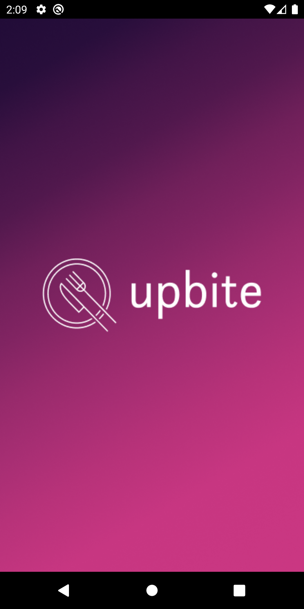
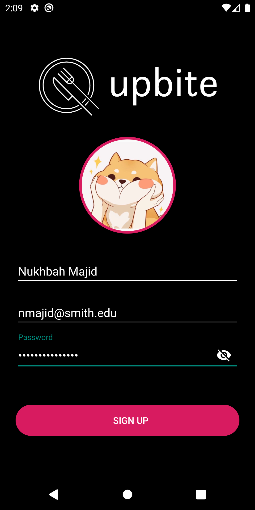
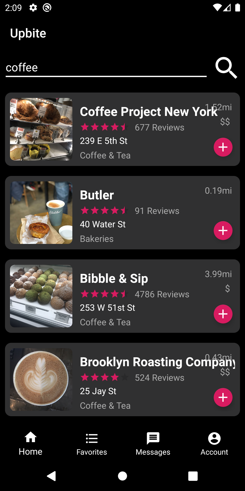
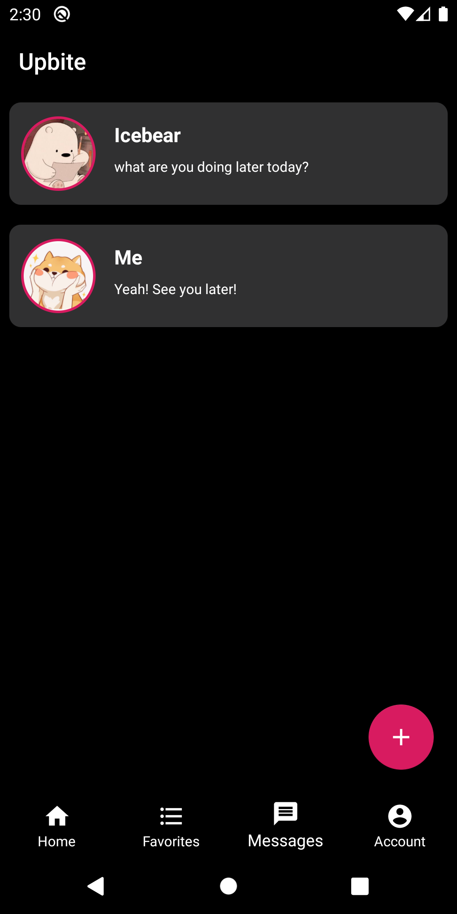
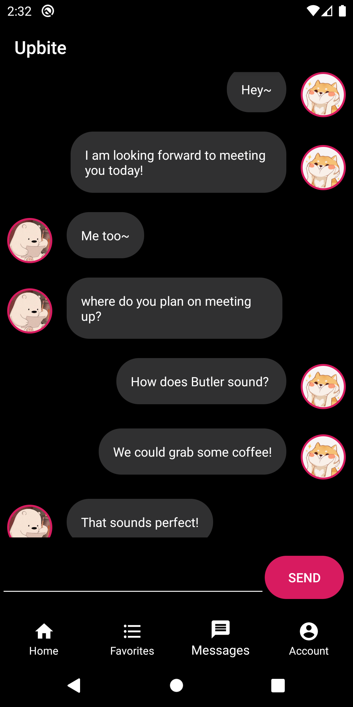
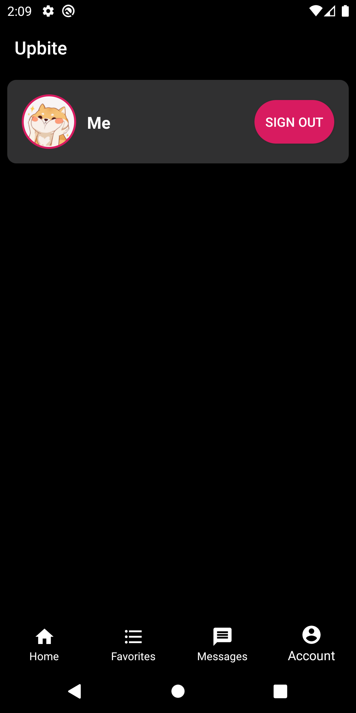

# Upbite
An android app to make deciding where to eat out easier - Upbite helps you browse restaurants near you, add them to your favorites, message your friends about and vote on a place to eat out! 

The app allows users to sign up and maintain their accounts, search for places nearby with the help of the Yelp API, and message friends registered on Upbite. The users can also add their favorite restaurants to a personalized favorites list. 

## Features 

Upbite provides the user with multiple features such as browsing restaurants or cafe by location, saving their favorite places, and messaging their friends all about it. These are supported through the following features: 
  - Registration and Login of new and existing users supported by Firebase Authentication.
  - Search results for queries relating to local restaurants, cafes, etc. via calls made to the Yelp API via HTTP client for Android, Retrofit. 
  - Categorizing places by favorites and saving them for each user in the real-time database by Firebase, Firestore. 
  - Messages that can be sent to registered users on Upbite - these conversations are stored uniquely for each user in the Firebase Storage. 
  

  
  
  

  
  
  

## Repository Structure

## Future Improvements 

The app is an ongoing project and is currently under development. The favorites and location specifying features for search results are currently incomplete and are edxpected to be launched with next version. 

### Contributors

Nukhbah Majid - sole contributor.

